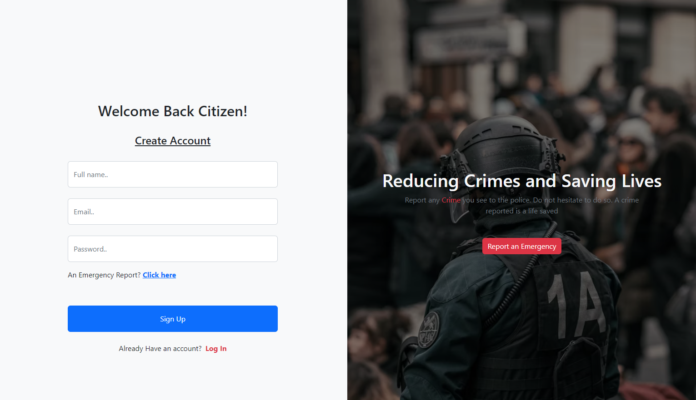
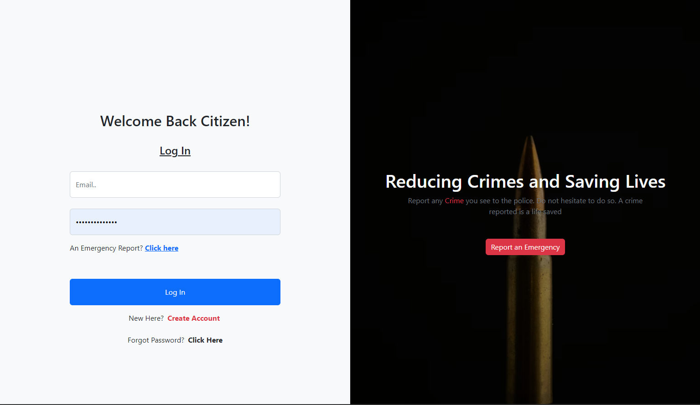
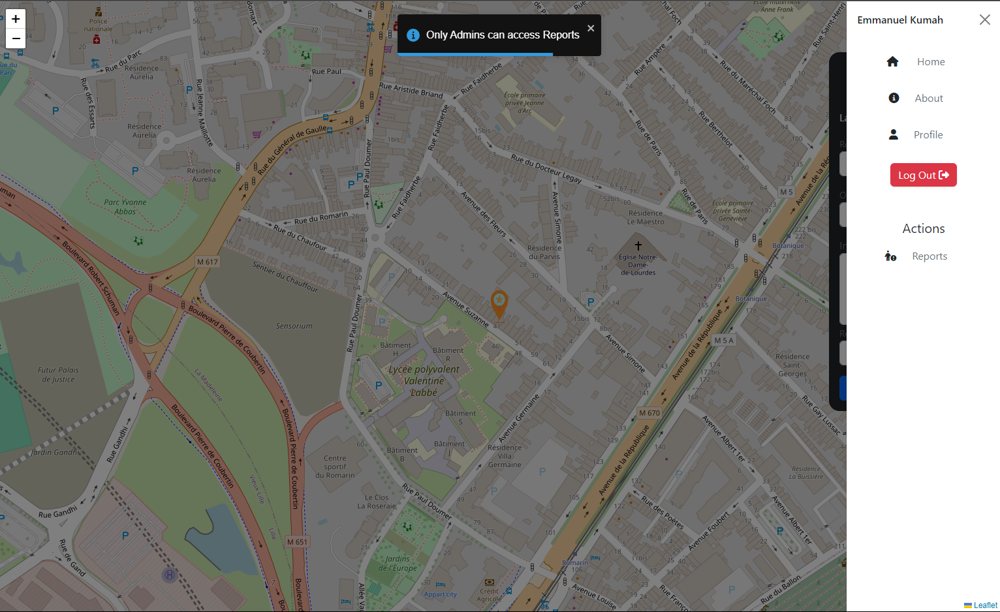

## Crime Reporting System

Crime Reporting System is a React web app that allows civilians to easily report crimes happening in their community. The app is designed to be user-friendly, with a simple and intuitive interface that makes it easy for people to submit crime reports quickly and easily.

The app allows users to submit a crime report by entering a description of the crime, the location where it occurred, and any other relevant information. Users can also upload photos or videos of the crime if they have them. Once a report is submitted, it is sent to the appropriate authorities for review and investigation.

The app also includes a map feature that shows the location of reported crimes in the community, allowing users to stay informed about criminal activity in their area.

#### Features

1. Easy-to-use interface for submitting crime reports
2. Ability to upload photos or videos of the crime
3. Map feature displaying reported crimes in the community
4. Reports sent directly to the appropriate authorities for review and investigation

# Getting Started

To get started with Crime Reporter, you will need to have Node.js and npm installed on your machine.

Clone the repository
Copy code
git clone https://github.com/[username]/crime-reporter.git
Install the dependencies
Copy code
npm install
Start the development server
Copy code
npm start
Open http://localhost:3000 to view the app in the browser.
Contribution
Fork the repository
Create your branch (git checkout -b feature/myfeature)
Commit your changes (git commit -am 'Add some feature')
Push to the branch (git push origin feature/myfeature)
Create a new Pull Request
s.

##### Note

You'll need to provide your own firebase APi credentials to be able store data in your own firebase.
Visit https://firebase.com to create one

#### Acknowledgments

React - JavaScript library for building user interfaces
LeafLet - Open source mapping platform
React-Bootrap - React components for faster and easier web development.
Crime Reporter is a useful and powerful tool for keeping communities safe by making it easy for civilians to report criminal activity. We hope you find it useful and we welcome any feedback or contributions to improve the app.
